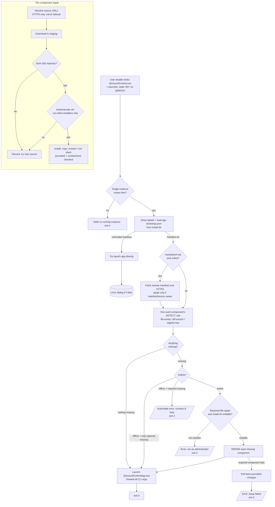

# QGroundControl Windows Bootstrap Launcher — Architecture & Deliverables

This document is the design overview for the Windows bootstrap launcher: the
startup/update/dependency flow diagram, the module map, the list of files the
feature touches, and the build / packaging / security notes. For the manifest
**schema** and field-by-field reference see [`README.md`](README.md).

## Goal

On a clean Windows machine, double-clicking **`QGroundControl.exe`** must be
sufficient to run the application. The Windows loader resolves an executable's
Qt and MSVC-runtime DLLs *before* `main()` runs, so a self-check inside the Qt
application can never recover a missing core DLL — the process fails to start
first. The solution is a separate launcher process that owns the
`QGroundControl.exe` name, verifies/repairs the runtime, then starts the real Qt
application (renamed `QGroundControlApp.exe`).

The download/repair path is a **safety net**: the NSIS installer still ships the
full Qt/QML/MSVC runtime, so on a normal install every component is already
present and **no network access occurs**. Repair only fires if files are missing
or corrupt, or the VC++ runtime is somehow absent.

## Startup / update / dependency flow



Plain-text summary of the decision points:

1. **Single-instance** mutex `Global\QGroundControlLauncher` — a second launch
   defers to the first and exits.
2. **Load manifest** `qgc-bootstrap.json` from the install dir; optionally adopt
   a newer remote manifest authorized by `manifestUrl`.
3. **Detect** each component; if none missing → launch immediately, no network.
4. **Offline** branch: only-optional-missing → launch anyway; required-missing →
   actionable error.
5. **Permission** branch: a required copy/extract repair into a non-writable
   install dir (Program Files) → ask the user to run as administrator.
6. **Repair**: download (HTTPS + mirror failover) → verify SHA-256 → verify
   Authenticode (run-silent only) → install (journaled, rollback on failure).
7. **Launch** `QGroundControlApp.exe`, forwarding all CLI arguments verbatim.

### Exit codes

| Code | Meaning |
|------|---------|
| 0 | App launched (or deferred to a running launcher instance). |
| 1 | App failed to start, or no manifest and direct launch failed. |
| 2 | Required component missing and machine offline. |
| 3 | Download/install of a required component failed (changes rolled back). |
| 4 | Required file-repair needs a non-writable install dir (run as admin). |

## Module map (`src/`)

| Module | Responsibility |
|--------|----------------|
| `main.cpp` | Entry point; CoInitialize, single-instance mutex, splash lifetime, exit code. |
| `Orchestrator.{h,cpp}` | The flow above: load → detect → offline/permission gates → repair → launch. |
| `Config.{h,cpp}` | Manifest model + JSON→`Manifest` parsing; source-URL resolution (HTTPS-only); component-name safety. |
| `Json.{h,cpp}` | Dependency-free JSON (jsonc-tolerant) parser. |
| `Detector.{h,cpp}` | `file-exists` / `dll-version` / `registry-key` detection. |
| `Downloader.{h,cpp}` | WinHTTP download; HTTPS-only, no HTTPS→HTTP redirects, progress, partial-file cleanup. |
| `Connectivity.cpp` | `InternetGetConnectedState` online probe (isolated from WinHTTP TU). |
| `Hash.{h,cpp}` | Streaming SHA-256 (BCrypt) + constant-time hex compare. |
| `Zip.{h,cpp}` | Archive extraction via System32 `tar.exe` (bsdtar), PowerShell fallback. |
| `Installer.{h,cpp}` | `copy`/`extract`/`run-silent` with a journal, containment guard, and rollback. |
| `Elevation.{h,cpp}` | Elevation check, UAC `runas` launch, Authenticode + publisher verification, writability probe. |
| `ProcessLauncher.{h,cpp}` | Spawn the Qt app, forwarding the original command line verbatim. |
| `SplashWindow.{h,cpp}` | Threaded Win32 progress window + modal error dialog. |
| `Logger.{h,cpp}` | Rotating UTF-8 log at `%LOCALAPPDATA%\QGroundControl\launcher.log`. |

## Files added / modified by this feature

**Added — `deploy/windows/launcher/`**
- `CMakeLists.txt` — `qgc_launcher` target (static CRT, Win32-only libs, no `-Werror`).
- `app.manifest` — `asInvoker`, Common-Controls v6, DPI/long-path aware.
- `Launcher.rc.in` — icon + version-info + manifest resource.
- `qgc-bootstrap.json` — the dependency manifest (ships in `bin/`).
- `src/*.{h,cpp}` — the launcher modules in the table above.
- `tools/gen_manifest_hashes.py` — fills real SHA-256/size into the manifest.
- `README.md`, `ARCHITECTURE.md` — schema reference and this document.

**Modified — build/packaging wiring (all gated on `QGC_WINDOWS_BOOTSTRAP`, default OFF)**
- `CMakeLists.txt` — when enabled, rename the Qt app to `…App.exe` and `add_subdirectory(deploy/windows/launcher)`.
- `cmake/CustomOptions.cmake` — the `QGC_WINDOWS_BOOTSTRAP` option.
- `cmake/install/Install.cmake` — windeployqt `--compiler-runtime`; install `qgc-bootstrap.json` into `bin/`.
- `cmake/install/CreateWinInstaller.cmake` — pass `APPEXE` (the Qt app) to NSIS.
- `deploy/windows/nullsoft_installer.nsi` — `APPEXE`/`EXENAME` split for excludes, WER keys, shortcuts.
- `.github/workflows/build-windows-exe.yml` — `enable_bootstrap` input (default ON); collect both exes.

## Build

```bat
qt-cmake -B build -G Ninja -DCMAKE_BUILD_TYPE=Release -DQGC_WINDOWS_BOOTSTRAP=ON
cmake --build build --config Release
cmake --install build --config Release
```

`qgc_launcher` is MSVC-only and statically links the CRT (`/MT`); the Qt app
keeps the dynamic CRT (`/MD`). They coexist via per-target `MSVC_RUNTIME_LIBRARY`.
Default builds (`QGC_WINDOWS_BOOTSTRAP=OFF`) are completely unaffected.

## Packaging

`cmake --install` runs windeployqt (now with `--compiler-runtime`) and copies
`qgc-bootstrap.json` into `bin/`, then `CreateWinInstaller.cmake` invokes NSIS.
The installer's user-facing executable is the launcher (`QGroundControl.exe`);
shortcuts and the ARP `DisplayIcon` point at it, while WER crash-dump keys and
build-artifact excludes target the Qt app (`QGroundControlApp.exe`).

To publish a runtime bundle for the self-heal path (optional under the safety-net
model): build the bundle ZIP(s), run
`python tools/gen_manifest_hashes.py --manifest qgc-bootstrap.json --artifacts-dir <dir> --download`,
upload the artifacts + manifest to a GitHub Release, and (optionally) set
`manifestUrl` so installed clients adopt updates without an app rebuild.

## Security considerations

- **SHA-256 mandatory** on every artifact; mismatch discards the file and tries
  the next source. Content is never installed unverified (fail-closed; the
  shipped placeholder zero-hashes therefore block any unintended download).
- **HTTPS only**, enforced twice: `resolveSourceUrls` drops non-HTTPS sources and
  the downloader refuses them; HTTPS→HTTP redirects are disallowed.
- **Authenticode** (`WinVerifyTrust` + publisher subject match) is verified before
  any `run-silent` installer (e.g. the VC++ redist) executes.
- **No silent elevation** — the launcher manifest is `asInvoker`; UAC is raised
  only for components flagged `"elevate"`. A required file-repair into a
  non-writable Program Files surfaces a "run as administrator" message (exit 4)
  rather than silently elevating.
- **Path-traversal defense in depth** — component `name` (used for staging paths)
  rejects separators and `..`; archives extract via bsdtar (which refuses `..`/
  absolute members) into an isolated staging dir; every placed file is
  containment-checked against the install dir before writing; the PowerShell
  extraction fallback single-quote-escapes its paths.
- **Manifest trust** — the local manifest lives in admin-write-only Program Files.
  A remote manifest is fetched only when the local file authorizes it via
  `manifestUrl`, over HTTPS, is adopted only if strictly newer, and its
  components still require SHA-256 (+ Authenticode for installers). Trust for
  remote artifacts ultimately rests on the HTTPS host and the recorded hashes.
- **Residual notes** — Authenticode uses `WTD_REVOKE_NONE` (no revocation
  fetch); the bsdtar PowerShell fallback only matters on pre-1803 Windows, which
  is outside the manifest's supported-OS range.
```
